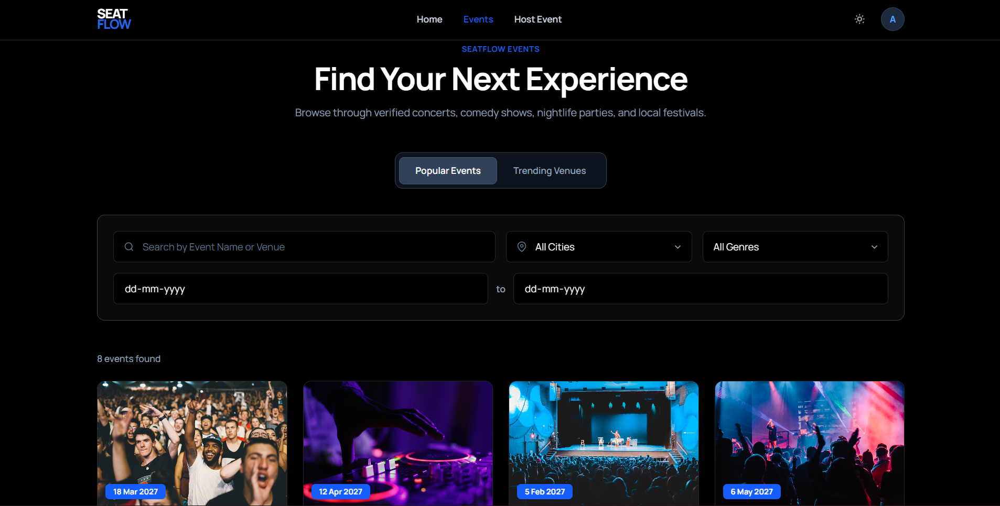
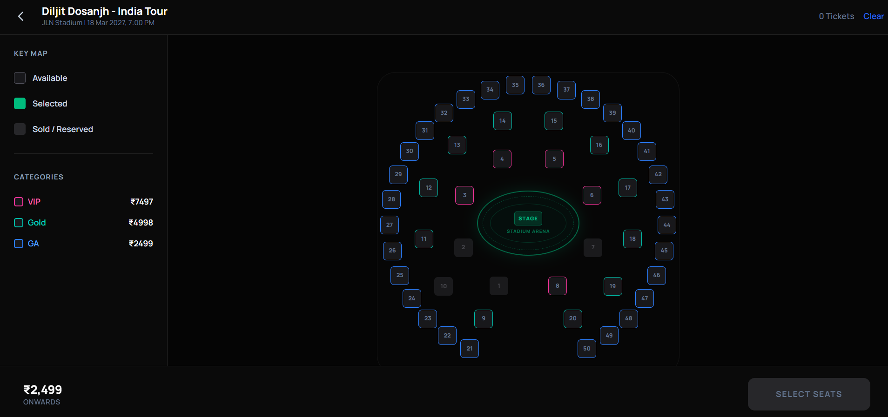
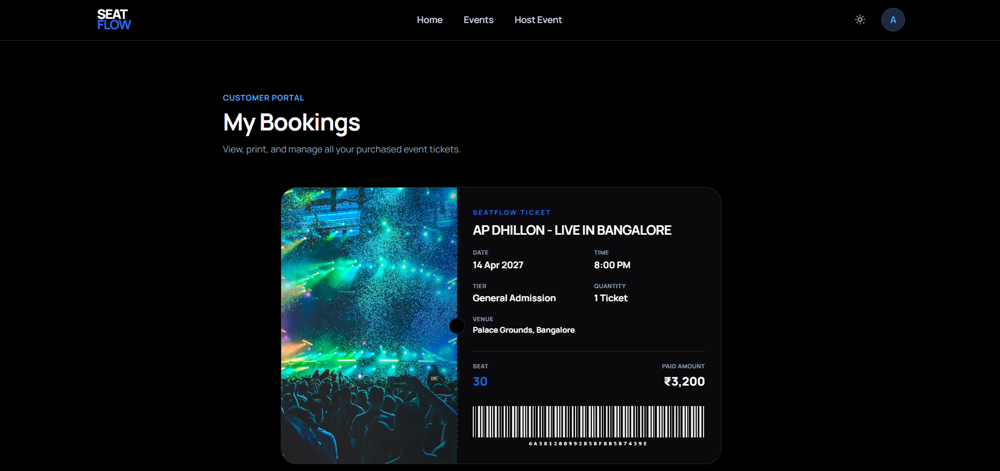

# SeatFlow

A transaction-safe event ticketing and live seating reservation platform.


---

## Screenshots

| Hero Landing Page | Detailed Event Filter |
| :---: | :---: |
|  |  |
| *Hero banner with search overlay* | *Explore with real-time text & city filters* |

| Seating Arena Layout | Customer Booking Ticket |
| :---: | :---: |
|  |  |
| *Interactive concentric stadium seating chart* | *Dynamic ticket details with live barcode generation* |

---

## Key Features

*   **Circular Seating Charts:** Concentric stadium layouts optimized for concert/nightlife venues, alongside traditional grids for standard halls.
*   **Double-Booking Prevention:** Locks and modifies seat allocations at the database layer using MongoDB transaction rollbacks.
*   **10-Minute Hold Reservation:** Visual countdown hold timer backed by a background interval worker cleaning expired reservations.
*   **Dynamic Tier Pricing:** Automatically applies pricing multipliers for VIP (3x), Gold (2x), and General Admission (1x) tiers.
*   **Razorpay & Mock Gateways:** Integrated checkouts with an automatic mock payment gateway fallback for offline testing.
    
    
*   **Organizer Dashboard:** Full dashboard utility to register, manage, and edit active events.

---

## Installation & Setup

### 1. Backend Service
1. Navigate to `/backend` and install dependencies:
   ```bash
   cd backend
   npm install
   ```
2. Create a `.env` file inside `/backend` with the following variables:
   ```env
   PORT=5000
   MONGO_URI=your_mongodb_atlas_connection_string
   JWT_SECRET=your_jwt_signing_key_here
   RAZORPAY_KEY_ID=rzp_test_mockKeyId123
   RAZORPAY_KEY_SECRET=mockKeySecret123
   ```
3. Initialize the database and launch:
   ```bash
   npm run seed
   npm run dev
   ```
   *The backend API gateway will launch on `http://localhost:5000`*

### 2. Frontend Web App
1. Navigate to `/frontend` and install dependencies:
   ```bash
   cd ../frontend
   npm install
   ```
2. Create a `.env` file inside `/frontend`:
   ```env
   VITE_API_URL=http://127.0.0.1:5000/api
   ```
3. Start the dev server:
   ```bash
   npm run dev
   ```
   *The frontend interface will launch on `http://localhost:5173`*

---

## Design Decisions & Architecture

### Double-Booking Prevention (ACID Transactions)
To ensure absolute reliability during high-concurrency ticket sales, SeatFlow handles seat reservations in isolation using **MongoDB ACID Transactions**:

1. **Atomic Matching:** Database updates query only seats matching `{ status: "available" }`.
2. **Isolation:** If two users click the same seat at the exact same millisecond, the database only matches and processes the update command for the first request.
3. **Mongoose Session Check:** The backend checks if the number of modified documents matches the requested seats (`modifiedCount === seatNumbers.length`).
4. **Instant Rollback:** If any seat fails the check, the session triggers an abort, rolls back all seat updates, and serves a `409 Conflict` response to the user.


### Temporary Hold Expiration Strategy
Instead of locking inventory indefinitely, selected seats are held for **10 minutes**:
*   **Backend interval daemon:** A lightweight background interval worker runs every 60 seconds on the Express server to locate expired reservation holds and automatically revert their corresponding seat states to `"available"`.
*   **Just-in-Time check:** A validation check is also run at checkout to ensure expired seats cannot be paid for.

---

## Environment Assumptions

> [!IMPORTANT]
> **MongoDB Replica Sets:** Because MongoDB transactions (`startTransaction`) are utilized, a MongoDB Atlas cluster or a local instance configured as a Replica Set is required. Standard standalone local installations of MongoDB do not support transactional rollbacks.

> [!TIP]
> **Razorpay Gateway Simulation:** The backend automatically defaults to sandbox mode if `RAZORPAY_KEY_ID` contains the keyword `mock` or is left blank. This allows full booking/payment tests locally without a live merchant account.

---

## Deployment

*   **Frontend:** Deployed on **Vercel** (with fallback routing configured in `vercel.json` for React Router).
*   **Backend:** Deployed on **Render** (Node.js/Express service connected to a live database).
*   **Database:** Hosted on **MongoDB Atlas** (running on a multi-node replica set for ACID transaction support).
